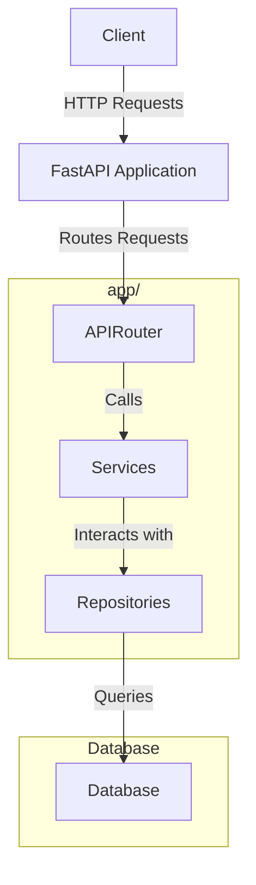

## Adopted Technologies
- [FastAPI](https://fastapi.tiangolo.com/)
- [SQLModel](https://sqlmodel.tiangolo.com/)
- [Pydantic](https://pydantic-docs.helpmanual.io/)
- [Alembic](https://alembic.sqlalchemy.org/en/latest/)

## Usage

### Run the application
```bash
docker compose up -d
```

Access the API at `http://localhost:8000/docs`

### Migrate the database
Attach to the container
```bash
docker compose exec api bash
```

Run the migration
```bash
alembic upgrade head
```

### Generate a new migration
First, update the schema file `app/schemas.py` and then run the following command

```bash
alembic revision --autogenerate -m "{migration title}"
```

### Downgrade the database
```bash
alembic downgrade -1
```

## Init development data

### Run the seeds
```bash
docker compose exec api python -m dev_seeds
```

### Test Accounts
- **Malme_Admin**
  - **Username**: malme@example.com
  - **Password**: malme1234
- **Admin**
  - **Username**: test@example.com
  - **Password**: test1234


## Directory Structure
```
project-name/
├── app/
│   ├── models/            # Pydantic Models
│   ├── repositories/      # Data Access Layer
│   ├── routers/           # API Endpoints
│   │   ├── api_router.py  # Router
│   ├── services/          # Business Logic Layer
│   ├── utils/             # Utility functions
│   ├── database.py        # Database Connection
│   └── schema.py          # SQLModel Schema
├── migrations/            # Alembic Migrations
├── dev_seeds.py           # Development Data Seeder
├── Dockerfile             # Dockerfile
├── docker-compose.yml     # Docker Compose Configuration
├── main.py                # FastAPI Application
└── requirements.txt       # Python Dependencies
```

### Models
`app/models/` ディレクトリには、Pydanticモデルが含まれています。これらのモデルは、データのバリデーションやシリアライゼーションに使用されます。

### Repositories
`app/repositories/` ディレクトリには、データアクセス層が含まれています。データベースとのやり取りを抽象化し、CRUD操作を提供します。

### Routers
`app/routers/` ディレクトリには、APIエンドポイントが含まれています。各エンドポイントは、特定の機能に対応するルーターに分割されています。

### Services
`app/services/` ディレクトリには、ビジネスロジック層が含まれています。アプリケーションの主要なビジネスロジックを実装します。

### Utils
`app/utils/` ディレクトリには、ユーティリティ関数が含まれています。これらの関数は、アプリケーション全体で再利用される汎用的な機能を提供します。

### Database
`app/database.py` ファイルは、データベース接続を管理します。データベースとの接続設定やセッション管理を行います。

### Schema
`app/schema.py` ファイルには、SQLModelスキーマが含まれています。データベーステーブルの定義を行います。

### Migrations
`migrations/` ディレクトリには、Alembicマイグレーションが含まれています。データベーススキーマのバージョン管理を行います。

### Dev Seeds
`dev_seeds.py` ファイルは、開発用のデータシーダーです。開発環境で使用する初期データを挿入します。

### Dockerfile
`Dockerfile` は、アプリケーションのDockerイメージをビルドするための設定ファイルです。

### Docker Compose
`docker-compose.yml` ファイルは、Docker Composeの設定ファイルです。複数のDockerコンテナを一括で管理します。

### Main Application
`main.py` ファイルは、FastAPIアプリケーションのエントリーポイントです。アプリケーションの起動とルーティングを設定します。

### Requirements
`requirements.txt` ファイルには、Pythonの依存関係がリストされています。必要なパッケージをインストールするために使用します。


## Implementation Details
基本的に下記の構成に従って開発を行います。

### Routers
`app/routers/` ディレクトリには、APIエンドポイントが含まれています。各エンドポイントは、特定の機能に対応するルーターに分割されています。ルーターは、FastAPIの`APIRouter`を使用して定義され、エンドポイントごとに異なるHTTPメソッド（GET、POST、PUT、DELETEなど）を処理します。これにより、コードの可読性とメンテナンス性が向上します。

### Services
`app/services/` ディレクトリには、ビジネスロジック層が含まれています。サービス層は、アプリケーションの主要なビジネスロジックを実装し、ルーターとリポジトリの間の橋渡しを行います。これにより、ビジネスロジックがルーターやリポジトリに直接書かれることを防ぎ、コードの再利用性とテストの容易さが向上します。

### Repositories
`app/repositories/` ディレクトリには、データアクセス層が含まれています。リポジトリ層は、データベースとのやり取りを抽象化し、CRUD操作（作成、読み取り、更新、削除）を提供します。これにより、データベース操作が集中管理され、データアクセスコードの再利用性とメンテナンス性が向上します。


